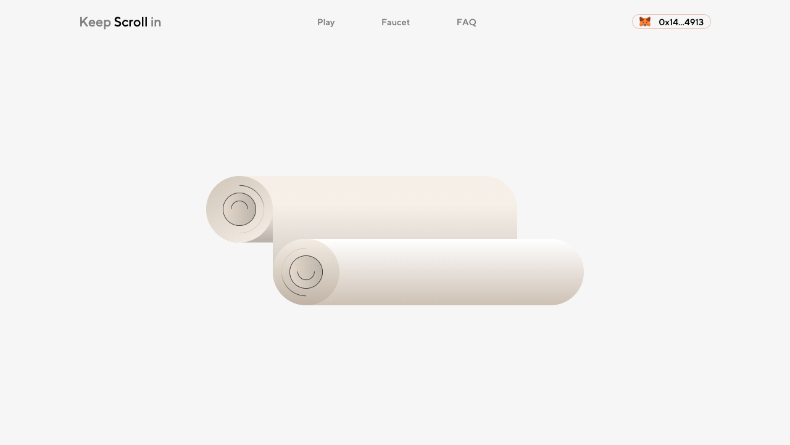

# Keep Scroll in
Project submission for ETH Global 2023

_STATUS: v1 Contract is deployed and live on Scroll Testnet._

## Description

The idea behind this project was to build a playful usecase for the Scroll testnet.
As for now, It's a double or nothing game where players can bet on the length of the Scroll.
Driving away from the classic coin flip's games, it can evolve in many directions with a focus on design, art and technology.

It was built using React as a framework, to get dynamic files/states; and Ethers, to connect to the blockchain and send the transactions. 

The game's smart contract was written, tested & deployed on Remix. 
For now, the "random" length is created on-chain by encoding the owner address with the current block timestamp, and a Math function is JS.

The scroll is made of code. It's an svg element, which make it more easy to manipulate than an image. 

## Links

- [www](https://keep-scroll.in)
- [figma](https://figma.com/file/Nm0K0iPyS8Z13pDavzj2JN)
- [contract](https://blockscout.scroll.io/address/0x68cd17A476E31Aa16f5e2c0d1463D356f658fB16)